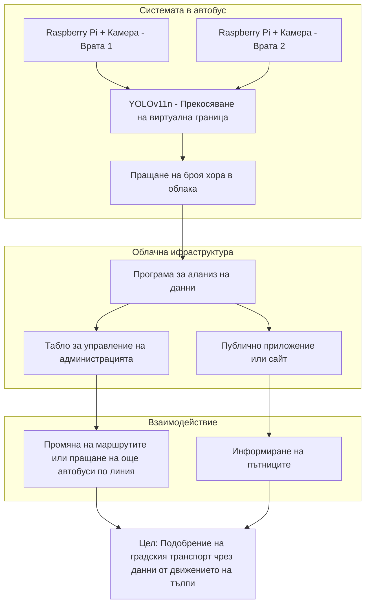

# Diagram



# Commands

`python ./svcounter.py -m video -i ./videos/walking_people.mp4`

`flask --app .\api\server.py run --host=0.0.0.0`

`ffmpeg -i videos/FootfallVideo.mp4 -vf  "scale=trunc(iw/2)*2:trunc(ih/2)*2" -c:a copy videos/scaleddown-FootfallVideo.mp4`

# Video sources

TODO

# Code sources

- https://supervision.roboflow.com/develop/notebooks/count-objects-crossing-the-line/

# Model

https://github.com/ultralytics/assets/releases/download/v8.3.0/yolo11n.pt

```bibtex
@software{yolo11_ultralytics,
  author = {Glenn Jocher and Jing Qiu},
  title = {Ultralytics YOLO11},
  version = {11.0.0},
  year = {2024},
  url = {https://github.com/ultralytics/ultralytics},
  orcid = {0000-0001-5950-6979, 0000-0002-7603-6750, 0000-0003-3783-7069},
  license = {AGPL-3.0}
}   
```

